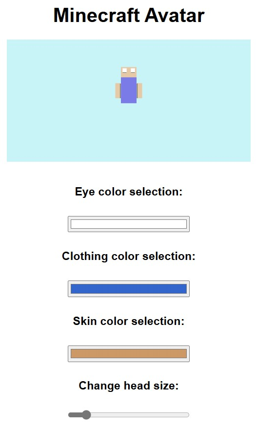

# Minecraft Avatar - Interactive 3D Visualization

## About project
The project is an interactive visualization of Minecraft characters using X3DOM technology. The user can customize the appearance of the avatar by changing 
the colors of the eyes, clothes and skin, as well as adjust the size of the head. In addition, the character simulates blinking, which adds realism.

## Technologies
The project uses HTML, JavaScript and X3DOM, which allows rendering three-dimensional objects in the browser without the need for additional plug-ins. 
X3DOM handles interactive 3D graphics, while JavaScript is responsible for dynamically changing the appearance of the model and blink animation.

## Implementation
The model consists of simple solids (cubes) representing the head, body and limbs. The user can change the colors and size of the head using HTML interface 
elements. Interactions are handled by JavaScript, which dynamically updates X3DOM material attributes and animates the blinking effect by periodically changing 
the color of the eyes.

## Results

